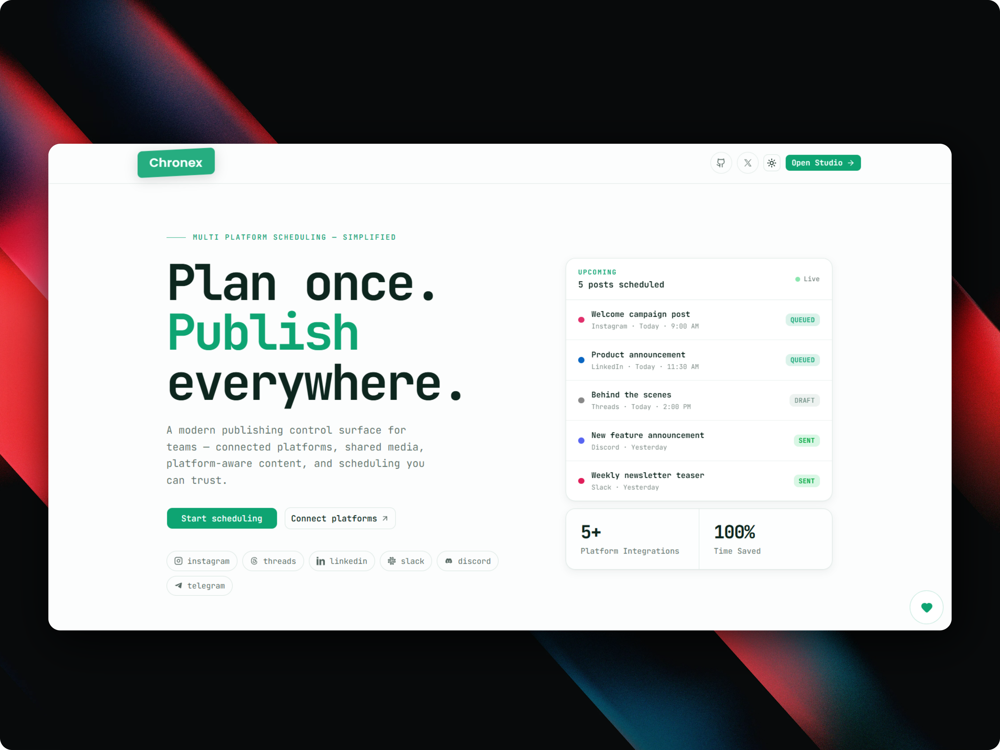

# publr

<div align="center">

<h1>Publr</h1>

<p>Multi-platform social media scheduling for creators and small teams.</p>

<p>
  <a href="#"></a>
  <a href="#"></a>
  <a href="#"></a>
  <a href="#"></a>
  <a href="./LICENSE"></a>
</p>

<p>
  <a href="#how-publr-works">How it works</a> ·
  <a href="#installation">Installation</a> ·
  <a href="#supported-platforms">Platforms</a> ·
  <a href="#contributing">Contributing</a>
</p>


</div>

---

## What's Inside

| Package             | Description                                                                        |
| ------------------- | ---------------------------------------------------------------------------------- |
| `apps/publr-client` | Next.js 16 app — auth, tRPC, media upload, workspace UI, platform connection flows |
| `apps/publr-worker` | Cloudflare Worker — consumes queue jobs, publishes content, updates post status    |
| `packages/db`       | Shared Drizzle schema and Neon/Postgres client                                     |

## Supported Platforms

<table>
  <tr>
    <td align="center"></td>
    <td align="center"></td>
    <td align="center"></td>
  </tr>
  <tr>
    <td align="center"></td>
    <td align="center"></td>
    <td align="center"></td>
  </tr>
</table>

## How Publr Works

```
User signs in → creates workspace
        ↓
Platform tokens stored per workspace in DB
        ↓
Media uploaded to Backblaze B2 → metadata saved to Neon
        ↓
Post created → one `posts` row + one `platform_posts` row per target platform
        ↓
If post is within 12h → pushed directly to Cloudflare Queues
        ↓
Cron sweep runs every 12h → enqueues anything pending in next window
        ↓
Worker consumes messages → dispatches correct platform handler
```

## Prerequisites

- Node.js 20+
- pnpm 10+
- Postgres database (Neon recommended)
- Backblaze B2 bucket
- Cloudflare account with Queues + Workers enabled
- OAuth apps / bots for each platform you want to connect

## Installation

### 1. Clone and install

```bash
git clone https://github.com/prncexe/publr.git
cd publr
pnpm install
```

### 2. Set up environment files

Publr uses three separate env surfaces:

<details>
<summary><b>A. Client env</b> — <code>apps/publr-client/.env</code></summary>

```bash
cp apps/publr-client/.env.example apps/publr-client/.env
```

Key groups to fill in:

| Group        | Variables                                                              |
| ------------ | ---------------------------------------------------------------------- |
| Database     | `DATABASE_URL`                                                         |
| Better Auth  | `BETTER_AUTH_SECRET`, `BETTER_AUTH_URL`                                |
| App URL      | `NEXT_PUBLIC_APP_URL`                                                  |
| Backblaze B2 | `B2_KEY_ID`, `B2_APP_KEY`, `B2_BUCKET_ID`, `B2_DOWNLOAD_URL`           |
| Cloudflare   | `CLOUDFLARE_ACCOUNT_ID`, `CLOUDFLARE_QUEUE_ID`, `CLOUDFLARE_API_TOKEN` |
| Platforms    | GitHub, Google, Instagram, Threads, LinkedIn, Slack, Discord, Telegram |

</details>

<details>
<summary><b>B. Worker env</b> — <code>apps/publr-worker/.dev.vars</code></summary>

```bash
cp apps/publr-worker/.dev.vars.example apps/publr-worker/.dev.vars
```

Required locally:

```
DATABASE_URL
DISCORD_BOT_TOKEN
DISCORD_WEBHOOK_NAME
DISCORD_WEBHOOK_AVATAR_URL
B2_KEY_ID
B2_APP_KEY
B2_BUCKET_ID
B2_DOWNLOAD_URL
```

</details>

<details>
<summary><b>C. DB / Drizzle env</b> — <code>packages/db/.env</code></summary>

```bash
cp packages/db/.env.example packages/db/.env
```

Set `DATABASE_URL`. This is what Drizzle reads when running schema commands from the shared DB package.

</details>

### 3. Push the database schema

```bash
pnpm db:push
```

Or with migrations:

```bash
pnpm db:generate
pnpm db:migrate
```

### 4. Start local development

```bash
# Both client + worker
pnpm dev

# Client only
pnpm dev:web

# Worker only
pnpm dev:worker
```

## OAuth Callback URLs

Configure your platform apps to use these callback URLs:

| Platform  | Local                                      | Production                                   |
| --------- | ------------------------------------------ | -------------------------------------------- |
| Instagram | `http://localhost:3000/instagram`          | `https://your-domain.com/instagram`          |
| Threads   | `http://localhost:3000/threads`            | `https://your-domain.com/threads`            |
| LinkedIn  | `http://localhost:3000/linkedin`           | `https://your-domain.com/linkedin`           |
| Slack     | `http://localhost:3000/slack`              | `https://your-domain.com/slack`              |
| Discord   | `http://localhost:3000/discord`            | `https://your-domain.com/discord`            |
| Telegram  | `http://localhost:3000/api/oauth/telegram` | `https://your-domain.com/api/oauth/telegram` |

> For production, update `BETTER_AUTH_URL`, `NEXT_PUBLIC_APP_URL`, and every `NEXT_PUBLIC_*_REDIRECT_URI`.

## Backblaze B2 Setup

Chronex stores all uploaded media in B2 and generates authorized download URLs for both the app and worker.

### 1. Create a bucket and note your credentials

```
B2_KEY_ID
B2_APP_KEY
B2_BUCKET_ID
B2_DOWNLOAD_URL
```

### 2. Apply the CORS policy

Replace the placeholders in `scripts/backblaze/cors-rules.json`:

```
YOUR_ACCOUNT_ID
YOUR_BUCKET_ID
https://your-app-domain.com
http://localhost:3000
```

Then apply it:

```bash
# Linux/macOS
./scripts/backblaze/apply-cors.sh YOUR_B2_ACCOUNT_AUTH_TOKEN

# Windows
./scripts/backblaze/apply-cors.ps1 -AuthorizationToken YOUR_B2_ACCOUNT_AUTH_TOKEN
```

Or manually via curl:

```bash
curl https://api.backblazeb2.com/b2api/v2/b2_update_bucket \
  -H "Authorization: YOUR_B2_ACCOUNT_AUTH_TOKEN" \
  -H "Content-Type: application/json" \
  --data-binary "@scripts/backblaze/cors-rules.json"
```

## Cloudflare Queue & Worker Setup

### 1. Create the queues

Create both queues in Cloudflare:

- `chronex-platform-jobs`
- `chronex-dlq`

### 2. Verify `wrangler.toml`

The worker expects:

- Producer binding: `PUBLR_QUEUE_PRODUCER`
- Consumer queue: `chronex-platform-jobs`
- Dead letter queue: `chronex-dlq`
- Cron trigger: every 12 hours

### 3. Deploy the worker

```bash
pnpm --filter worker deploy
```

### 4. Set production secrets

```bash
cd apps/chronex-worker

wrangler secret put DATABASE_URL
wrangler secret put DISCORD_BOT_TOKEN
wrangler secret put B2_KEY_ID
wrangler secret put B2_APP_KEY
wrangler secret put B2_BUCKET_ID
wrangler secret put B2_DOWNLOAD_URL
```

> `DISCORD_WEBHOOK_NAME` and `DISCORD_WEBHOOK_AVATAR_URL` can be secrets or plain vars depending on your preference.

### 5. Verify

```bash
pnpm --filter worker tail
curl https://YOUR_WORKER_URL/health
```

## Telegram Notes

Telegram has a different connection flow from the other OAuth providers:

- Chronex registers a webhook at `/api/oauth/telegram`
- The bot token is stored in the auth token table for the workspace
- Users connect a Telegram group or channel by sending a generated registration code in that target chat
- Private chats with the bot are not used as publish destinations
- Telegram channel add links require admin permissions; Chronex requests `post_messages` for channel setup

Required env vars:

```
TELEGRAM_BOT_TOKEN
NEXT_PUBLIC_TELEGRAM_BOT_USERNAME
TELEGRAM_WEBHOOK_SECRET
```

## Useful Commands

```bash
pnpm dev              # Start client + worker
pnpm dev:web          # Start client only
pnpm dev:worker       # Start worker only
pnpm build            # Build all packages
pnpm format           # Format codebase
pnpm format:check     # Check formatting
pnpm db:push          # Push schema to DB
pnpm db:studio        # Open Drizzle Studio
```

## Contributing

See [CONTRIBUTING.md](./CONTRIBUTING.md).

1. Fork the repo
2. Create a feature branch
3. Update docs/examples if setup behavior changes
4. Open a PR with a clear summary — include screenshots for UI changes

## Support

<a href="https://github.com/sponsors/prncexe"></a>
<a href="https://ko-fi.com/prncexe"></a>
<a href="https://paypal.me/prncexe"></a>

## License

[MIT](./LICENSE) — use it however you like.
